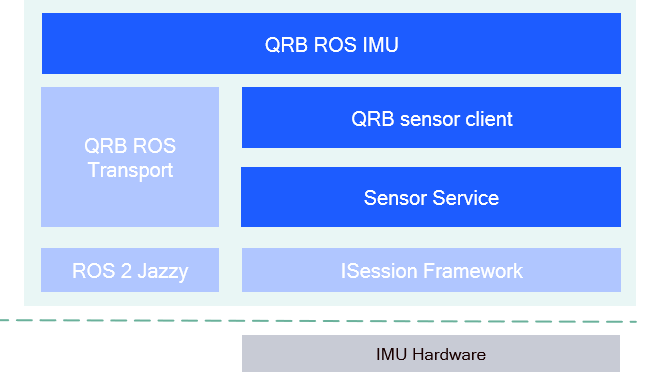

<div align="center">
  <h1>QRB ROS IMU</h1>
  <p align="center">
    
  </p>
  <p>ROS Packages for IMU Hardware on Qualcomm Robotics Platforms</p>

  <a href="https://ubuntu.com/download/qualcomm-iot" target="_blank"></a>
  <a href="https://docs.ros.org/en/jazzy/" target="_blank"></a>

</div>

---

## 👋 Overview

The [QRB ROS IMU](https://github.com/qualcomm-qrb-ros/qrb_ros_imu) is a ROS package that publishes IMU data collected from ICM-42688 hardware on the Qualcomm Robotics Platform. It provides:

- Composable ROS Node support.
- Zero-Copy transport powered by [QRB ROS Transport](https://github.com/qualcomm-qrb-ros/qrb_ros_transport).

<div align="center">
  
</div>

<br>

The [`qrb_ros_imu`](https://github.com/qualcomm-qrb-ros/qrb_ros_imu/tree/main/qrb_ros_imu) is a ROS 2 package. It creates a publisher with qrb_ros_transport for zero-copy transport. It supports node composition, making it possible to improve performance using ROS intra-process communication.

The [`qrb_sensor_client`](https://github.com/qualcomm-qrb-ros/qrb_ros_imu/tree/main/qrb_sensor_client) is a C++ library, it provides APIs to `qrb_ros_imu` for querying imu data from lower layer `Sensor Service`.

The [`qrb_ros_transport`](https://github.com/qualcomm-qrb-ros/qrb_ros_transport) is a ROS 2 package, it supports zero-copy implements ROS type adaptation to the sensor data structures defined by Android, make it compatible with both intra- and inter-process communication.

The `Sensor Service` is Qualcomm sensor framework, it exports APIs for accessing Qualcomm-powered device 's IMU hardware.

The `ISession Framework` provides the foundation for sensor data collecting on Qualcomm-powered devices.

## 🔎 Table of contents
- [APIs](#-apis)
  - [`qrb_ros_imu` APIs](#-qrb_ros_imu-apis)
  - [`qrb_sensor_client` APIs](#-qrb_sensor_client-apis)
- [Supported targets](#-supported-targets)
- [Installation](#-installation)
- [Usage](#-usage)
  - [Start the imu node](#start-the-imu-node)
  - [Enable zero copy transport](#enable-zero-copy-transport)
  - [Change the imu frequency](#change-the-imu-frequency)
- [Build from source](#-build-from-source)
- [Contributing](#-contributing)
- [Contributors](#️-contributors)
- [FAQs](#-faqs)
- [License](#-license)

## ⚓ APIs

### 🔹 `qrb_ros_imu` APIs

#### ROS interfaces

<table>
  <tr>
    <th>Interface</th>
    <th>Name</th>
    <th>Type</th>
    <td>Description</td>
  </tr>
  <tr>
    <td>Publisher</td>
    <td>/imu</td>
    <td>sensor_msgs/msg/Imu</td>
    <td>output imu data</td>
  </tr>
</table>

#### ROS parameters

<table>
  <tr>
    <th>Name</th>
    <th>Type</th>
    <th>Description</td>
    <th>Default Value</td>
  </tr>
  <tr>
    <td>debug</td>
    <td>bool</td>
    <td>To measure the latency from IMU data generation to its output by the ROS node.</td>
    <td>false</td>
  </tr>
</table>

### 🔹 `qrb_sensor_client` APIs

<table>
  <tr>
    <th>Function</th>
    <th>Parameters</th>
    <th>Description</th>
  </tr>
  <tr>
    <td>bool create_connection()</td>
    <td>Empty</td>
    <td>Connect with sensor service, return <b>true</b> means create successfully.</td>
  </tr>
  <tr>
    <td>void disconnect_server()</td>
    <td>Empty</td>
    <td>Disconnect with sensor service.</td>
  </tr>
  <tr>
    <td>bool get_imu_data(sensors_event_t ** accel_ptr, sensors_event_t ** gyro_ptr, int32_t * sample_count)</td>
    <td>
      <ul>
        <li><b>accel_ptr</b>: Pointer to accelerometer data</li>
        <li><b>gyro_ptr</b>: Pointer to gyroscope data</li>
        <li><b>sample_count</b>: Number of samples available</li>
      </ul>
    </td>
    <td>Retrieves IMU data. Returns <b>true</b> if successful. If <b>true</b>, <b>accel_ptr</b> and <b>gyro_ptr</b> will point to the latest IMU data, and <b>sample_count</b> specifies how many samples were retrieved.</td>
  </tr>
</table>

## 🎯 Supported targets

<table >
  <tr>
    <th>Development Hardware</th>
    <td>Qualcomm Dragonwing™ RB3 Gen2</td>
  </tr>
  <tr>
    <th>Hardware Overview</th>
    <th><a href="https://www.qualcomm.com/developer/hardware/rb3-gen-2-development-kit"></a></th>
  </tr>
  <tr>
    <th>IMU Hardware</th>
    <td>ICM-42688</td>
  </tr>
</table>

---

## ✨ Installation

> [!IMPORTANT]
> **PREREQUISITES**: The following steps need to be run on **Qualcomm Ubuntu** and **ROS Jazzy**.<br>
> Reference [Install Ubuntu on Qualcomm IoT Platforms](https://ubuntu.com/download/qualcomm-iot) and [Install ROS Jazzy](https://docs.ros.org/en/jazzy/index.html) to setup environment. <br>
> For Qualcomm Linux, please check out the [Qualcomm Intelligent Robotics Product SDK](https://docs.qualcomm.com/bundle/publicresource/topics/80-70018-265/introduction_1.html?vproduct=1601111740013072&version=1.4&facet=Qualcomm%20Intelligent%20Robotics%20Product%20(QIRP)%20SDK) documents.

Add Qualcomm IOT PPA for Ubuntu:

```bash
sudo add-apt-repository ppa:ubuntu-qcom-iot/qcom-noble-ppa
sudo add-apt-repository ppa:ubuntu-qcom-iot/qirp
sudo apt update
```

Install Debian package:

```bash
sudo apt install ros-jazzy-qrb-ros-imu
```

## 🚀 Usage

### Start the imu node

```bash
source /opt/ros/jazzy/setup.bash
ros2 run qrb_ros_imu imu_node
```

The output for these commands:

```bash
[INFO] [0315964882.610733770] [imu_node]: imu client connect success
[INFO] [0315964882.614361843] [imu_node]: imu component running...
[INFO] [SensorClient]: sensor client recv from msg. User set sample_rate: 200 adjusted sample_rate: 200 len: 8
[INFO] [SensorClient]: send get config success
[INFO] [SensorClient]: recvmsg success
...
```

Then you can check ROS topics with the topic `/imu`.

```bash
ros2 topic list
/imu
```

### Enable zero copy transport

The `qrb_ros_imu` supports directly sharing imu data between nodes, which can avoid imu data memory copy with DDS in intra-process mode.

For detail about this feature, see https://docs.ros.org/en/rolling/Concepts/Intermediate/About-Composition.html

We recommend using `launch` to compose multiple nodes:

```python
def generate_launch_description():
    container = ComposableNodeContainer(
        name='my_container',
        namespace='',
        package='rclcpp_components',
        executable='component_container',
        composable_node_descriptions=[
            ComposableNode(
                name='imu',
                package='qrb_ros_imu',
                plugin='qrb_ros::imu::ImuComponent'
            ),
            ComposableNode(
                package='qrb_ros_imu',
                plugin='qrb_ros::imu::ImuListener',
                name='imu_test',
            )
        ],
        output='screen',
    )

    return launch.LaunchDescription([container])
```

### Change the imu frequency

To change the IMU sampling frequency:
1. Edit the `/etc/sensors_info.conf` file and set the desired frame rate to `sample_rate`.
```bash
imu:
  sample_rate: 200
```

2. Restart the `sensor-service`(a systemd service) to apply the changes.
```bash
sudo systemctl restart sensor-service
```
> [!Note]
> ⚠️ Make sure to set the frame rate according to the actual supported values of your IMU hardware. If you choose an unsupported value, the system will automatically adjust it to the nearest available frequency.

---

## 👨‍💻 Build from source

### Dependencies
Install dependencies `ros-dev-tools`:

```bash
sudo add-apt-repository ppa:ubuntu-qcom-iot/qcom-noble-ppa
sudo add-apt-repository ppa:ubuntu-qcom-iot/qirp
sudo apt update

sudo apt install ros-jazzy-qrb-ros-transport-imu-type \
  ros-dev-tools
```

### Build
Download the source code and build with colcon

```bash
source /opt/ros/jazzy/setup.bash
git clone https://github.com/qualcomm-qrb-ros/qrb_ros_imu.git
colcon build
```


## 🤝 Contributing

We love community contributions! Get started by reading our [CONTRIBUTING.md](CONTRIBUTING.md).<br>
Feel free to create an issue for bug report, feature requests or any discussion💡.

## ❤️ Contributors

Thanks to all our contributors who have helped make this project better!

<table>
  <tr>
    <td align="center"><a href="https://github.com/quic-zhanlin"><br /><sub><b>quic-zhanlin</b></sub></a></td>
    <td align="center"><a href="https://github.com/jiaxshi"><br /><sub><b>jiaxshi</b></sub></a></td>
    <td align="center"><a href="https://github.com/quic-zhaoyuan"><br /><sub><b>quic-zhaoyuan</b></sub></a></td>
    <td align="center"><a href="https://github.com/penww"><br /><sub><b>penww</b></sub></a></td>
  </tr>
</table>

## ❔ FAQs

<details>
<summary><strong>Why do I see the error: "IMU client connect failed"?</strong></summary>

- Please ensure that the IMU frame rate configured in <code>/etc/sensors_info.conf</code> is set within the range of <strong>0–500</strong>.
</details>

<details>
<summary><strong>Why is the configured frame rate sometimes different from the actual frame rate?</strong></summary>

- The IMU hardware only supports certain fixed frame rates.
- If you specify a frame rate that is not supported, the system will automatically round up to the nearest higher supported value.
</details>

## 📜 License

Project is licensed under the [BSD-3-Clause](https://spdx.org/licenses/BSD-3-Clause.html) License. See [LICENSE](./LICENSE) for the full license text.
